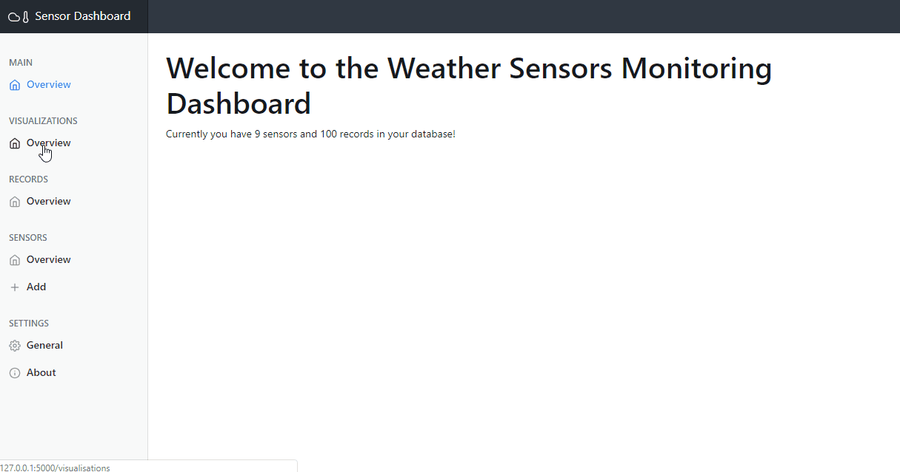

# Weather Sensor Dashboard

This project is used for **showing weather sensor data**, i.e. of a BME280 sensor. The project has been developed in Python with the Flask Framework.
Additionally, it uses Bootstrap, Chart.js, Moment.js, Popper.js and jQuery.

## Setup in a production environment
If you want to setup the project in a production environment, please use a WSGI server, i.e. [Waitress](https://docs.pylonsproject.org/projects/waitress/en/latest/).
To install the dependencies, please install python3 and python3-pip first and the run the following command:

~~~~
pip3 install Flask Flask-wtf waitress
~~~~

After you installed Flask, Flask-WTF and Waittress, you should first create the sqlite database by running (assuming you are running on a linux server):

~~~
export FLASK_APP=server
flask init-db
~~~

Now you should be able to run the project with

~~~~
python3 start.py
~~~~

Next, you can open the website using http://your.server:8080/. Please be aware, that you might need to open the port 8080 before.
In general, it is recommended, to use a reverse proxy like nginx for the waitress server. One could use, i.e. the following settings for nginx:

~~~~
location ~ /tmp_logger {
                proxy_pass http://127.0.0.1:8080/$request_uri;
                proxy_set_header Host $host;
}
~~~~

**Important**: Please change the SECRET_KEY in the __init__.py for security reasons

Now you can add new sensors using the menu on the left.

### Using the api to load sensordata

Please make a POST request to the following URL: ``http://your.server:8080/api/add`` as content use the following:

| POST-Field   | Description                                              |
|--------------|----------------------------------------------------------|
| sensorname   | The name of the sensor for which the data shall be saved |
| temperature  | The measured temperature (optional)                      |
| humidity     | The measured humidity (optional)                         |
| air_pressure | The measured air_pressure (optional)                     |

## Development
If you want to get started, please ensure you have Flask and Flask-WTF installed. If you did not install it yet, just run ``pip install Flask Flask-WTF``.
Then clone this directory, go into the cloned directory and run the following commands in the commandline (not powershell!):

~~~~
set FLASK_APP=server
set FLASK_ENV=development
flask init-db
flask run
~~~~

If you are using Unix Bash please run the following commands:

~~~~
export FLASK_APP=server
export FLASK_ENV=development
flask init-db
flask run
~~~~

Then you should be able to head over to http://localhost:5000/.

If you are now changing code, the server should automatically detect the changes and apply them.

## ToDo

- [ ] Timesliders / Limiters for defining how many records you want to show
- [ ] Combine multiple sensors to a group and show the mean / median / mod values in a given timerange
- [ ] ITTT: If the temperature of a sensor is higher than XYZ, do ZXY
- [ ] Battery Warning: Determine when the last record was sent by a sensor and output a battery warning, if it has been too long ago.

## Lincense
MIT. :)
